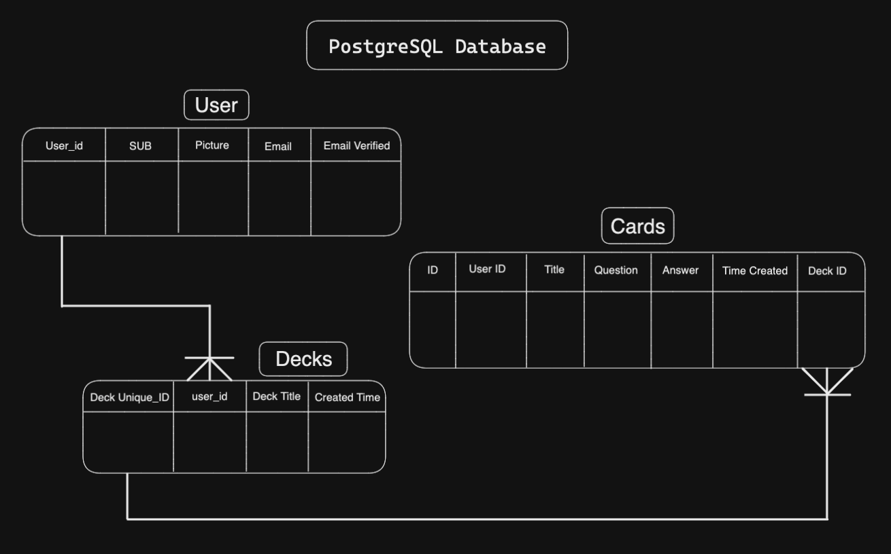

<!-- Improved compatibility of back to top link: See: https://github.com/othneildrew/Best-README-Template/pull/73 -->
<a name="readme-top"></a>
<!--
*** Thanks for checking out HugelMaps. If you have a suggestion
*** that would make this better, please fork the repo and create a pull request
*** or simply open an issue with the tag "enhancement".
*** Don't forget to give the project a star!
*** Thanks again! Now go create something AMAZING! :D
-->


<!-- PROJECT SHIELDS -->
<!--
*** I'm using markdown "reference style" links for readability.
*** Reference links are enclosed in brackets [ ] instead of parentheses ( ).
*** See the bottom of this document for the declaration of the reference variables
*** for contributors-url, forks-url, etc. This is an optional, concise syntax you may use.
*** https://www.markdownguide.org/basic-syntax/#reference-style-links
-->
[![Contributors][contributors-shield]][contributors-url]
[![Forks][forks-shield]][forks-url]
[![Stargazers][stars-shield]][stars-url]
[![Issues][issues-shield]][issues-url]


<!-- PROJECT LOGO -->
<br />
<div align="center">
  <a href="https://github.com/sea-spiders/tempo">
  </a>

  <h3 align="center">Tempo</h3>

  <p align="center">
    A flashcard study app!
    <br />
    <a href="https://github.com/sea-spiders/tempo"><strong>Explore the docs »</strong></a>
    <br />
    <a href="https://github.com/orgs/red-lipped-batfish-scad/projects/1/views/1"><strong>Explore the Project Board »</strong></a>
    <br />
    <br />
    <a href="https://github.com/sea-spiders/tempo">View Demo</a>
    ·
    <a href="https://github.com/sea-spiders/tempo/issues">Report Bug</a>
    ·
    <a href="https://github.com/sea-spiders/tempo/issues">Request Feature</a>
  </p>
</div>


<!-- TABLE OF CONTENTS -->
<details>
  <summary>Table of Contents</summary>
  <ol>
    <li>
      <a href="#about-the-project">About The Project</a>
      <ul>
        <li><a href="#built-with">Built With</a></li>
      </ul>
    </li>
    <li>
      <a href="#getting-started">Getting Started</a>
      <ul>
        <li><a href="#prerequisites">Prerequisites</a></li>
      </ul>
    </li>
    <li><a href="#roadmap">Roadmap</a></li>
    <li><a href="#contributing">Contributing</a></li>
    <li><a href="#license">License</a></li>
    <li><a href="#contact">Contact</a></li>
    <li><a href="#acknowledgments">Acknowledgments</a></li>
  </ol>
</details>


<!-- ABOUT THE PROJECT -->
## About The Project

Tempo is a client-oriented flashcard application that allows the user to create decks of flashcards and their own flashcards for the user to study. Flash cards help learners engage in memorization and long-term retention.    


## App Features:
* Google sign-in for secure user profile.
* Creating, deleting, & naming decks.
* Creating & deleting flash cards.
* Cards & decks specific to user.
<p align="right">(<a href="#readme-top">back to top</a>)</p>


## Database Entity Relationship Diagram

  <picture>
    <source media="(prefers-color-scheme: dark)" srcset="./assets/ER_Diagram.png">
    <source media="(prefers-color-scheme: light)" srcset="./assets/ER_Diagram.png">
    
  </picture>

<p align="right">(<a href="#readme-top">back to top</a>)</p>


### Built With
![webpack-shield] ![babel-shield] ![react-shield] ![react-router-shield] ![node-shield] 
![express-shield] ![elephantSQL-shield] ![jest-shield] ![testing-library-shield]

<p align="right">(<a href="#readme-top">back to top</a>)</p>


<!-- GETTING STARTED -->
## Getting Started

### Pull Request Notes
- Main branch is only for production.
- Dev branch is for development.
- Required two person review process for pull requests to the dev and main branch.

### Pushing changes to the main repo
- [ ] 1. 'Git checkout dev' (locally switch to dev branch)
- [ ] 2. 'Git pull origin dev' (Pull updates of dev down to your local system)
- [ ] 3. 'Git checkout [your branch] (switch back to your branch locally)
- [ ] 4. 'Git merge dev' (Brings dev into your local branch)
- [ ] 5. Resolve conflicts or :q if there aren't any
- [ ] 6. 'Git push origin <your branch>' (Push merged branch up to github)
- [ ] 7. Create a pull request in github from <your branch> ==> dev
- [ ] 8. Repeat as needed
- [ ] 9. When ready to publish main, do step 7 but from dev => main
  ```
  git checkout dev
  git pull origin dev
  git checkout <name/feature>
  git merge dev
  // Resolve Merge conflicts
  git push origin <name/feature>
  ```

### Prerequisites

This is an example of how to list things you need to use the software and how to install them.
* npm
  ```sh
  npm install 
<!--   ```

### Installation

_Below is an example of how you can instruct your audience on installing and setting up your app. This template doesn't rely on any external dependencies or services._

1. Get a free API Key at [https://example.com](https://example.com)
2. Clone the repo
   ```sh
   git clone https://github.com/your_username_/Project-Name.git
   ```
3. Install NPM packages
   ```sh
   npm install
   ```
4. Enter your API in `config.js`
   ```js
   const API_KEY = 'ENTER YOUR API';
   ``` -->

<p align="right">(<a href="#readme-top">back to top</a>)</p>


<!-- USAGE EXAMPLES -->
<!-- ## Usage

Use this space to show useful examples of how a project can be used. Additional screenshots, code examples and demos work well in this space. You may also link to more resources.

_For more examples, please refer to the [Documentation](https://example.com)_

<p align="right">(<a href="#readme-top">back to top</a>)</p>
 -->


<!-- ROADMAP -->
## Roadmap
- [ ] Add Flashcard custimization
- [ ] Sharing decks with other users
- [ ] Score tracker for the deck
- [ ] Score tracker for the cards


See the [open issues](https://github.com/sea-spiders/tempo/issues) for a full list of proposed features (and known issues).

<p align="right">(<a href="#readme-top">back to top</a>)</p>


<!-- CONTRIBUTING -->
## Contributing
Please feel free to make any contributions. We are excited to be part of the open source community and to see how others can improve and grow our project.

If you have a suggestion that would make this better, please fork the repo and create a pull request. You can also simply open an issue with the tag "enhancement".
Don't forget to give the project a star! Thanks again!

1. Fork the Project
2. Create your Feature Branch (`git checkout -b feature/AmazingFeature`)
3. Commit your Changes (`git commit -m 'Add some AmazingFeature'`)
4. Push to the Branch (`git push origin feature/AmazingFeature`)
5. Open a Pull Request

<p align="right">(<a href="#readme-top">back to top</a>)</p>


<!-- LICENSE -->
## License

Distributed under the MIT License. See `LICENSE.txt` for more information.

<p align="right">(<a href="#readme-top">back to top</a>)</p>


<!-- CONTACT -->
# Contact Info
| Developed By |    |    |
| :---:   | :---: | :---: |
| Josh Howard  | [![Github][github-shield]](https://github.com/JoshHowardDev)   | [![LinkedIn][linkedin-shield]](https://linkedin.com/in/JoshHowardDev)   |
| Daniel Doody  | [![Github][github-shield]](https://github.com/daniel-doody)   | [![LinkedIn][linkedin-shield]](https://www.linkedin.com/in/daniel-doody)   |
| Josh Edwards  | [![Github][github-shield]](https://github.com/JoshDPT)   | [![LinkedIn][linkedin-shield]](https://www.linkedin.com/in/joshuah-edwards-42a752129/)   |
| Troy Witonsky  | [![Github][github-shield]](https://github.com/TWitonsky)   | [![LinkedIn][linkedin-shield]](https://github.com/TWitonsky)   |

<p align="right">(<a href="#readme-top">back to top</a>)</p>


<!-- ACKNOWLEDGMENTS -->
## Acknowledgments

This space is to acknowledge different tools, docs, and resources that we used in creating this App. We have included a few of our favorites to kick things off!

* [Excalidraw](https://excalidraw.com/)
* [Elephant SQL](https://www.elephantsql.com/docs/)
* [npm](https://www.npmjs.com/)
* [Trello](https://trello.com/)
* [Stack Overflow](https://stackoverflow.com/questions/53499761/left-join-using-a-link-table-in-postgresql)
* [GitHub Pages](https://pages.github.com)
* [Font Awesome](https://fontawesome.com)
* [React Icons](https://react-icons.github.io/react-icons/search)
* [Choose an Open Source License](https://choosealicense.com)

<p align="right">(<a href="#readme-top">back to top</a>)</p>


<!-- MARKDOWN LINKS & IMAGES -->
<!-- https://www.markdownguide.org/basic-syntax/#reference-style-links -->
[contributors-shield]: https://img.shields.io/github/contributors/red-lipped-batfish-scad/scratchProject.svg?style=for-the-badge
[contributors-url]: https://github.com/sea-spiders/tempo/graphs/contributors
[forks-shield]: https://img.shields.io/github/forks/red-lipped-batfish-scad/scratchProject.svg?style=for-the-badge
[forks-url]: https://github.com/sea-spiders/tempo/network/members
[stars-shield]: https://img.shields.io/github/stars/red-lipped-batfish-scad/scratchProject.svg?style=for-the-badge
[stars-url]: https://github.com/sea-spiders/tempo/stargazers
[issues-shield]: https://img.shields.io/github/issues/red-lipped-batfish-scad/scratchProject.svg?style=for-the-badge
[issues-url]: https://github.com/sea-spiders/tempo/issues
[license-shield]: https://img.shields.io/github/license/red-lipped-batfish-scad/scratchProject.svg?style=for-the-badge
[license-url]: https://github.com/sea-spiders/tempo/blob/master/LICENSE.txt
[github-shield]: https://img.shields.io/badge/github-%23121011.svg?style=for-the-badge&logo=github&logoColor=white
[linkedin-shield]: https://img.shields.io/badge/-LinkedIn-black.svg?style=for-the-badge&logo=linkedin&colorB=555
[linkedin-url]: https://www.linkedin.com/in/christian-looff/
[webpack-shield]: https://img.shields.io/badge/webpack-%238DD6F9.svg?style=for-the-badge&logo=webpack&logoColor=black
[babel-shield]: https://img.shields.io/badge/Babel-F9DC3e?style=for-the-badge&logo=babel&logoColor=black
[react-shield]: https://img.shields.io/badge/React-20232A?style=for-the-badge&logo=react&logoColor=61DAFB
[webpack-shield]: https://img.shields.io/badge/webpack-%238DD6F9.svg?style=for-the-badge&logo=webpack&logoColor=black
[react-router-shield]: https://img.shields.io/badge/React_Router-CA4245?style=for-the-badge&logo=react-router&logoColor=white
[node-shield]: https://img.shields.io/badge/node.js-6DA55F?style=for-the-badge&logo=node.js&logoColor=white
[express-shield]: https://img.shields.io/badge/express.js-%23404d59.svg?style=for-the-badge&logo=express&logoColor=%2361DAFB
[elephantSQL-shield]: https://img.shields.io/badge/PostgreSQL-316192?style=for-the-badge&logo=postgresql&logoColor=white
[jest-shield]: https://img.shields.io/badge/-jest-%23C21325?style=for-the-badge&logo=jest&logoColor=white
[testing-library-shield]: https://img.shields.io/badge/-TestingLibrary-%23E33332?style=for-the-badge&logo=testing-library&logoColor=white

[product-screenshot]: images/screeenshot2.png

<!-- Library oof badges -->
[React-url]: https://reactjs.org/
[ElephantSQL]: https://img.shields.io/badge/PostgreSQL-316192?style=for-the-badge&logo=postgresql&logoColor=white
[ElephantSQL-url]: https://www.elephantsql.com/
[Webpack-url]: https://webpack.js.org/plugins/html-webpack-plugin/